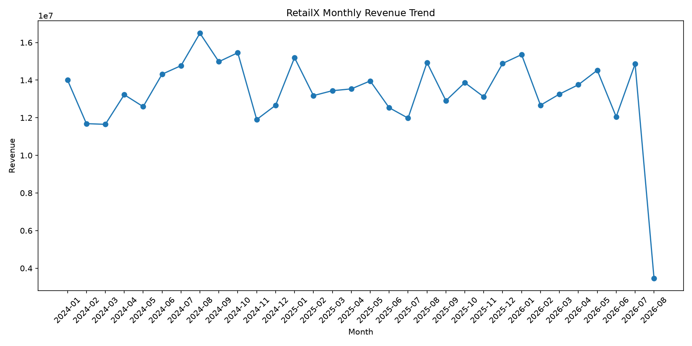
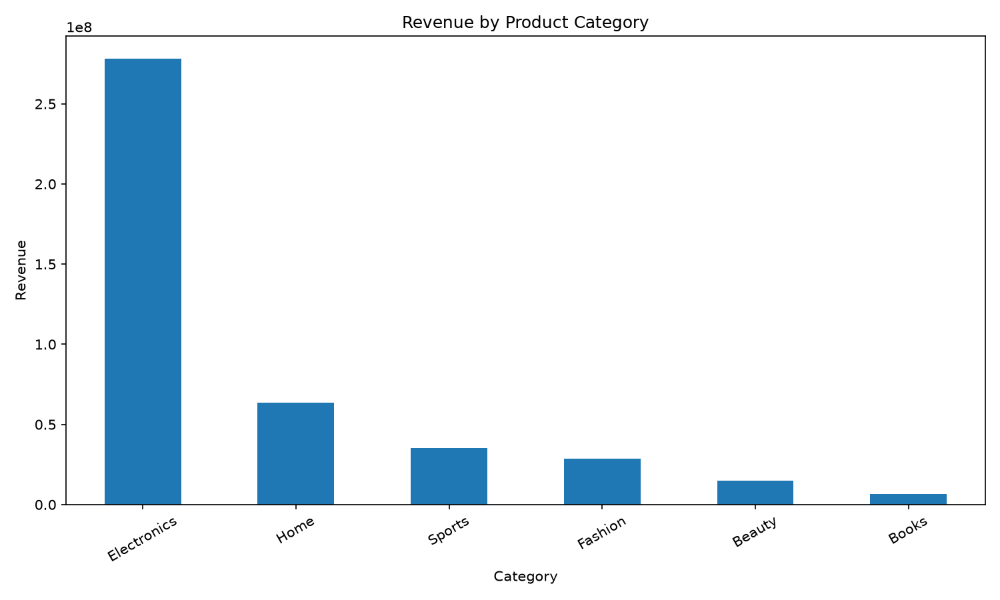
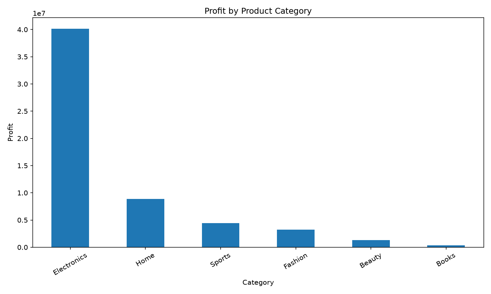
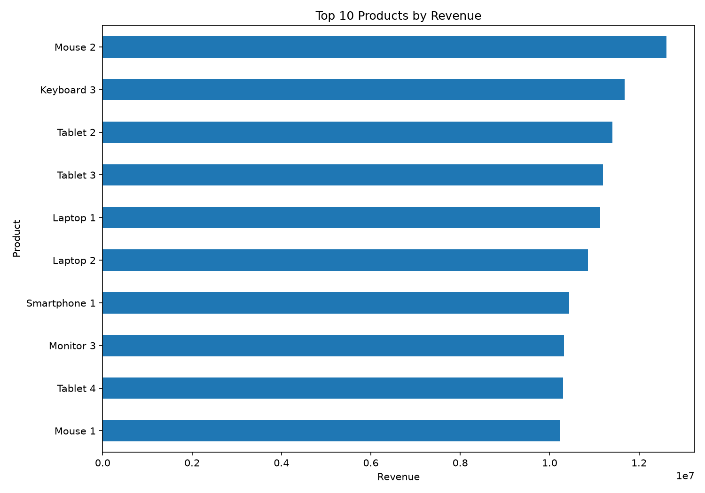
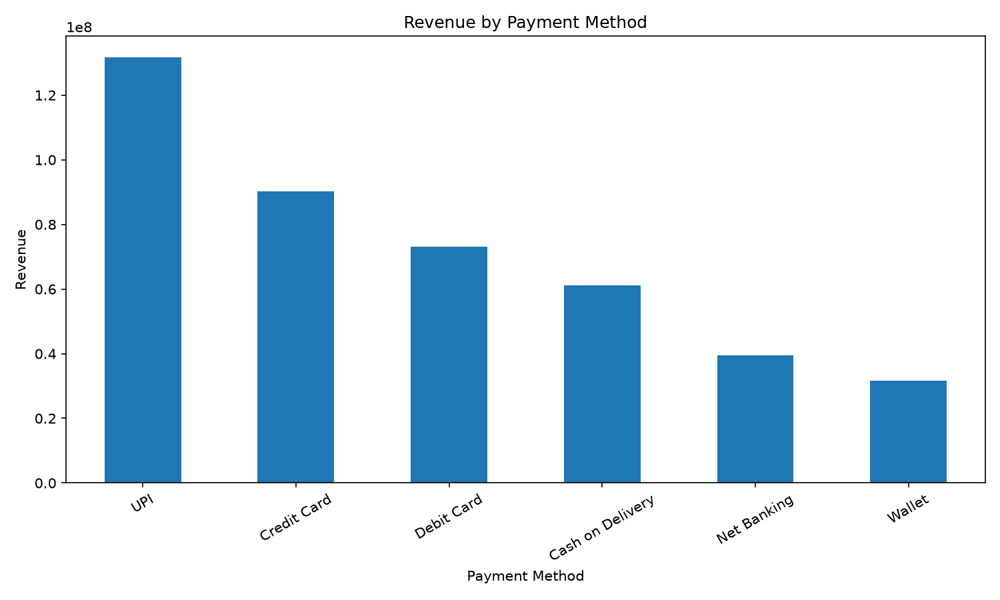
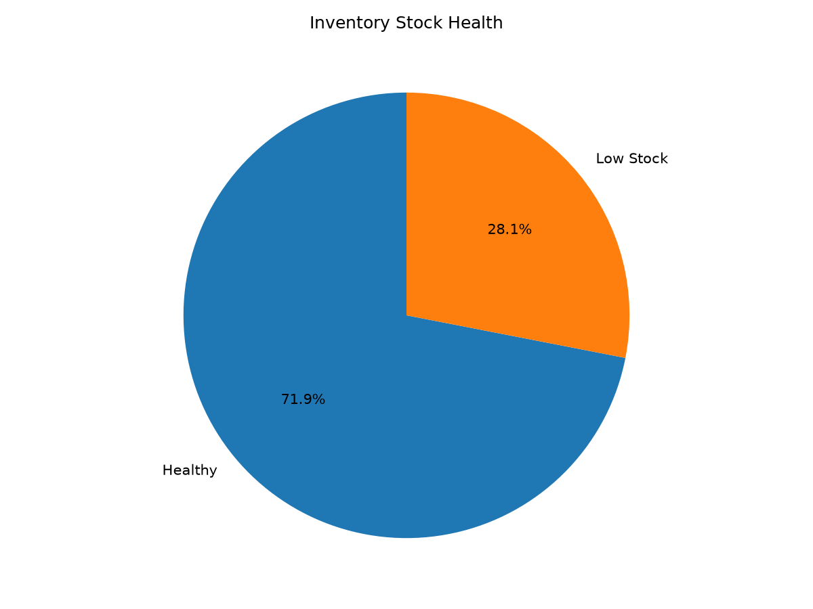
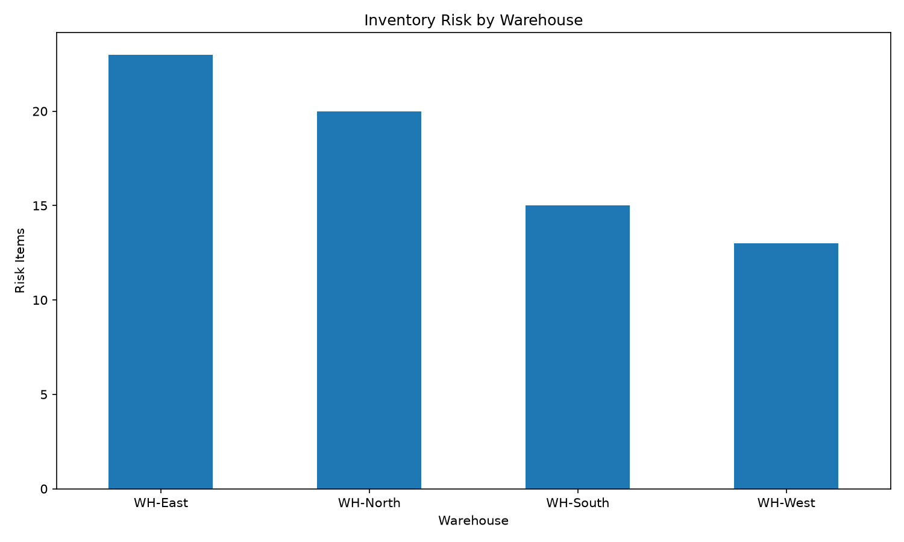
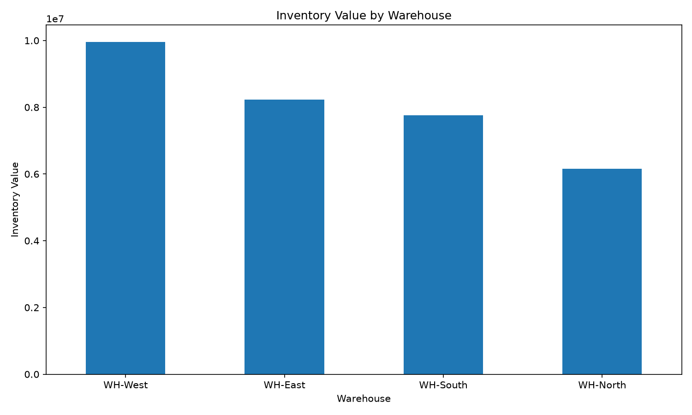

# RetailX — E-Commerce Sales & Inventory Analytics Platform

[](https://www.python.org/)
[](https://pandas.pydata.org/)
[](https://www.mysql.com/)
[](https://pytest.org/)
[](https://docs.github.com/en/actions)
[](https://opensource.org/license/mit/)

> End-to-end analytics platform for sales performance, profitability, customer analytics, inventory health, warehouse risk, and business intelligence using Python, Pandas, NumPy, SQL, MySQL, Pytest, and GitHub Actions.

---

## 📌 Project Overview

**RetailX** is a modular, production-style e-commerce analytics platform that transforms raw sales and inventory data into actionable business insights.

The project combines **Python analytics, SQL, MySQL, automated testing, data visualization, and CI automation** to simulate a real-world business analytics workflow.

### What RetailX analyzes

* Sales performance
* Revenue and profitability
* Customer value
* Product performance
* Category performance
* Monthly sales trends
* Payment-method performance
* Inventory health
* Warehouse exposure
* Inventory risk
* Reorder requirements

---

## 🎯 Business Problem

E-commerce businesses generate large volumes of transactional and inventory data.

RetailX is designed to answer important business questions such as:

* How much revenue and profit is being generated?
* What is the average order value?
* Which products generate the highest revenue?
* Which products are most profitable?
* Which customers contribute the most revenue?
* Which categories perform best?
* How is revenue changing month over month?
* Which payment methods generate the most revenue?
* Which inventory items require replenishment?
* Which warehouses have higher inventory exposure?
* Which products have higher inventory risk?

---

## 🏗️ System Architecture

```text
                    ┌─────────────────────┐
                    │     Raw CSV Data    │
                    │                     │
                    │ orders.csv          │
                    │ inventory_master    │
                    └──────────┬──────────┘
                               │
                               ▼
                    ┌─────────────────────┐
                    │   Data Cleaning     │
                    │   & Preparation     │
                    └──────────┬──────────┘
                               │
                               ▼
              ┌─────────────────────────────────┐
              │       Python Analytics           │
              │   Pandas • NumPy • Business KPI │
              └────────────────┬────────────────┘
                               │
                 ┌─────────────┴─────────────┐
                 ▼                           ▼
        ┌──────────────────┐       ┌──────────────────┐
        │ Sales Analytics  │       │ Inventory        │
        │ Revenue          │       │ Health           │
        │ Profit           │       │ Risk             │
        │ Customers        │       │ Reorder          │
        │ Products         │       │ Warehouse        │
        └────────┬─────────┘       └────────┬─────────┘
                 │                          │
                 └────────────┬─────────────┘
                              ▼
                    ┌─────────────────────┐
                    │        MySQL        │
                    │                     │
                    │ SQL Analytics       │
                    │ Views               │
                    │ Business Queries    │
                    └──────────┬──────────┘
                               │
                               ▼
                    ┌─────────────────────┐
                    │ Reports & Charts    │
                    │                     │
                    │ Matplotlib          │
                    │ KPIs                │
                    │ Business Insights   │
                    └─────────────────────┘
```

---

## 🛠️ Tech Stack

| Technology             | Purpose                              |
| ---------------------- | ------------------------------------ |
| Python                 | Core analytics pipeline              |
| Pandas                 | Data cleaning and analysis           |
| NumPy                  | Numerical operations                 |
| Matplotlib             | Business visualization               |
| SQL                    | Business analytics                   |
| MySQL                  | Relational data storage and analysis |
| mysql-connector-python | Python–MySQL integration             |
| python-dotenv          | Secure environment configuration     |
| Pytest                 | Automated testing                    |
| Git                    | Version control                      |
| GitHub                 | Source-code hosting                  |
| GitHub Actions         | Continuous Integration               |
| CSV                    | Raw and source data                  |

---

## 📊 Dataset

### Sales Dataset

RetailX analyzes:

* **20,000 orders**
* Customer information
* Product information
* Category
* Region
* Quantity
* Pricing
* Discounts
* Revenue
* Cost
* Profit
* Payment method
* Order status
* Delivery information

### Inventory Dataset

* **253 inventory records**
* **132 products**
* **4 warehouses**
* **4,383 total stock units**
* **₹32.11M inventory value**

Key inventory fields:

* Stock quantity
* Reorder level
* Reorder quantity
* Unit cost
* Inventory value
* Lead time
* Safety stock
* Stock status

---

## 📈 Key Business KPIs

| KPI                 |          Result |
| ------------------- | --------------: |
| Total Orders        |          20,000 |
| Total Customers     |           2,998 |
| Total Units Sold    |          47,732 |
| Total Revenue       | ₹427,215,572.78 |
| Total Profit        |  ₹58,340,553.09 |
| Average Order Value |      ₹21,360.78 |
| Profit Margin       |          13.66% |

### Business Interpretation

RetailX processed **20,000 orders** generating approximately **₹42.72 crore revenue** and **₹5.83 crore profit**.

The overall calculated profit margin is **13.66%**, while the average order value is approximately **₹21,361**.

---

## 📦 Inventory KPIs

| KPI                |         Result |
| ------------------ | -------------: |
| Inventory Records  |            253 |
| Products           |            132 |
| Warehouses         |              4 |
| Stock Units        |          4,383 |
| Inventory Value    | ₹32,112,380.43 |
| Healthy Items      |            182 |
| Low Stock Items    |             71 |
| Out of Stock Items |              0 |

---

## 🗄️ MySQL & SQL Analytics

RetailX integrates Python analytics with MySQL for structured storage and SQL-based business intelligence.

### MySQL Objects

```text
orders
inventory
vw_sales_kpi
vw_monthly_sales
vw_product_performance
inventory_risk_view
```

### SQL Analytics Covered

* Sales KPIs
* Revenue analysis
* Profit analysis
* Monthly sales trends
* Product performance
* Customer revenue ranking
* Customer segmentation
* Inventory risk
* Warehouse analysis
* Reorder analysis

### Example KPI Query

```sql
SELECT
    COUNT(*) AS total_orders,
    ROUND(SUM(net_revenue), 2) AS total_revenue,
    ROUND(SUM(profit), 2) AS total_profit,
    ROUND(AVG(net_revenue), 2) AS average_order_value
FROM orders;
```

### Example Result

```text
Total Orders       : 20,000
Total Revenue      : 427,215,572.78
Total Profit       : 58,340,553.09
Average Order Value: 21,360.78
```

---

## 👥 Customer Analytics

RetailX performs customer-level revenue analysis and segmentation.

Customer segments include:

* High Value
* Medium Value
* Low Value

### Customer Segment Results

| Segment      | Customers |   Total Revenue | Avg. Customer Revenue |
| ------------ | --------: | --------------: | --------------------: |
| High Value   |     1,626 | ₹355,153,514.78 |           ₹218,421.60 |
| Medium Value |       746 |  ₹54,164,127.75 |            ₹72,606.07 |
| Low Value    |       626 |  ₹17,897,930.25 |            ₹28,590.94 |

This helps identify customers who contribute disproportionately to overall revenue.

---

## 🏆 Product Analytics

RetailX identifies top-performing products based on units sold, revenue, and profitability.

Example high-performing products include:

| Product    | Category    | Units Sold | Revenue | Profit Margin |
| ---------- | ----------- | ---------: | ------: | ------------: |
| Mouse 2    | Electronics |        438 | ₹12.61M |        14.71% |
| Keyboard 3 | Electronics |        420 | ₹11.68M |        14.39% |
| Tablet 2   | Electronics |        385 | ₹11.41M |        12.03% |
| Tablet 3   | Electronics |        408 | ₹11.19M |        18.53% |
| Laptop 1   | Electronics |        435 | ₹11.14M |        14.65% |

---

## ⚠️ Inventory Risk Analysis

RetailX calculates inventory risk using factors such as:

* Current stock
* Reorder level
* Reorder quantity
* Safety stock
* Units sold
* Revenue exposure
* Warehouse
* Product category

The resulting risk analysis helps businesses prioritize:

* Replenishment
* Stock monitoring
* Warehouse planning
* Inventory optimization

---

## 📊 Visualizations

RetailX generates the following business charts:

### Monthly Revenue Trend



### Category Revenue



### Category Profit



### Top 10 Products



### Payment Method Revenue



### Stock Health



### Warehouse Inventory Risk



### Warehouse Inventory Value



---

## 🔄 End-to-End Pipeline

The complete RetailX workflow is executed through the main pipeline.

```text
Raw Data
   ↓
Inventory Master Generation
   ↓
Data Cleaning
   ↓
Business Analytics
   ↓
Inventory Analytics
   ↓
Visualization
   ↓
MySQL Analytics
```

Run the complete pipeline:

```bash
py src/main.py
```

Current pipeline result:

Successful steps : 6/6
Total execution  : ~11 seconds
RetailX pipeline completed successfully.
```

---

## 🧪 Testing

RetailX uses **Pytest** for automated testing.

Current test result:

```text
7 passed
```

Run tests:

```bash
py -m pytest -v
```

This helps validate core analytics and inventory business logic.

---

## ⚙️ GitHub Actions CI

RetailX includes an automated GitHub Actions CI pipeline.

The CI workflow:

1. Installs project dependencies
2. Runs automated tests
3. Validates the project

Workflow:

```text
.github/workflows/tests.yml
```

Current CI status: **Passing ✅**

---

## 🔐 Environment Configuration

Database credentials are managed through environment variables using `python-dotenv`.

Example `.env`:

```text
MYSQL_HOST=localhost
MYSQL_USER=root
MYSQL_PASSWORD=your_password
MYSQL_DATABASE=retailx
```

The `.env` file is excluded from GitHub using `.gitignore`.

Sensitive credentials should never be committed to source control.

---

## 📁 Project Structure

```text
retailx-ecommerce-analytics/
│
├── .github/
│   └── workflows/
│       └── tests.yml
│
├── data/
│   ├── raw/
│   └── processed/
│
├── reports/
│   └── figures/
│       ├── category_profit.png
│       ├── category_revenue.png
│       ├── monthly_revenue_trend.png
│       ├── payment_method_revenue.png
│       ├── stock_health.png
│       ├── top_10_products.png
│       ├── warehouse_inventory_risk.png
│       └── warehouse_inventory_value.png
│
├── sql/
│   └── analytics_queries.sql
│
├── src/
│   ├── analytics.py
│   ├── data_cleaning.py
│   ├── data_loader.py
│   ├── inventory.py
│   ├── inventory_master.py
│   ├── main.py
│   ├── mysql_loader.py
│   └── visualization.py
│
├── tests/
│
├── .gitignore
├── LICENSE
├── README.md
└── requirements.txt
```

---

## ⚙️ Installation

Clone the repository:

```bash
git clone https://github.com/ravishankar135-rsp/retailx-ecommerce-analytics.git
```

Move into the project:

```bash
cd retailx-ecommerce-analytics
```

Install dependencies:

```bash
py -m pip install -r requirements.txt
```

---

## ▶️ Run the Project

Run the complete analytics pipeline:

```bash
py src/main.py
```

Run automated tests:

```bash
py -m pytest -v
```

Run MySQL inventory-risk analytics:

```bash
py src/mysql_loader.py
```

---

## 🔍 Key Business Insights

RetailX can identify:

* High-value customer segments
* Top revenue-generating products
* High-profit products
* Monthly revenue trends
* Payment-method revenue distribution
* Low-stock inventory
* Inventory risk
* Warehouse inventory exposure
* Category-level inventory performance

These insights can support decisions related to:

* Sales strategy
* Customer retention
* Product strategy
* Inventory replenishment
* Warehouse planning
* Profitability improvement

---

## 🚀 Future Improvements

Potential future enhancements include:

* Power BI dashboard
* Streamlit analytics dashboard
* FastAPI REST API
* Docker deployment
* Cloud database integration
* Scheduled ETL pipelines
* Demand forecasting
* Machine-learning-based inventory prediction
* Automated anomaly detection

---

## 💼 MNC Interview Highlights

### What is RetailX?

RetailX is an end-to-end e-commerce analytics platform combining Python, Pandas, NumPy, SQL, MySQL, automated testing, visualization, and CI automation.

### Why MySQL?

MySQL provides structured relational storage and enables SQL-based business analytics, views, aggregations, ranking, and inventory analysis.

### Why Pytest?

Pytest validates core business logic automatically and helps prevent regressions when the project changes.

### Why GitHub Actions?

GitHub Actions automatically executes tests whenever changes are pushed, providing continuous integration.

### How are credentials protected?

Database credentials are stored in environment variables using `python-dotenv` and excluded from Git tracking through `.gitignore`.

---

## 👨‍💻 Author

**Ravishankar Prajapat**

Data Science | Python | SQL | Machine Learning

---

## 📌 Project Status

**Production-style portfolio project — Completed Core Analytics Pipeline ✅**

Python Analytics • SQL • MySQL • Inventory Risk • Visualization • Testing • CI
